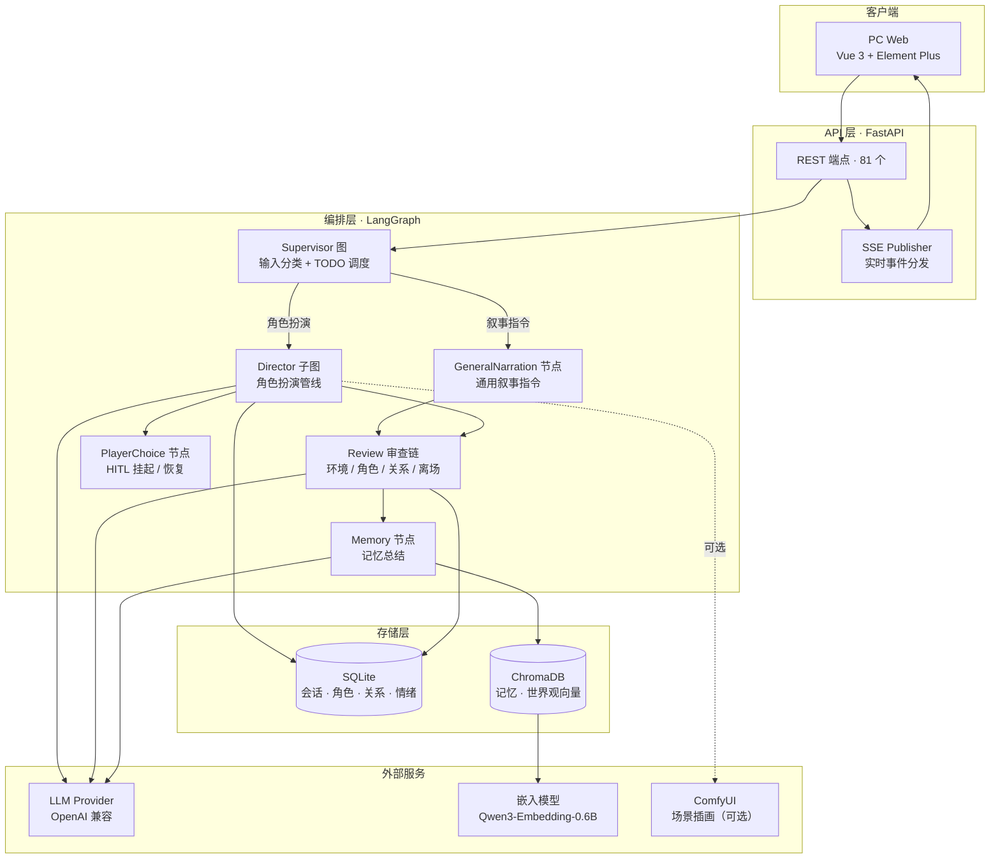
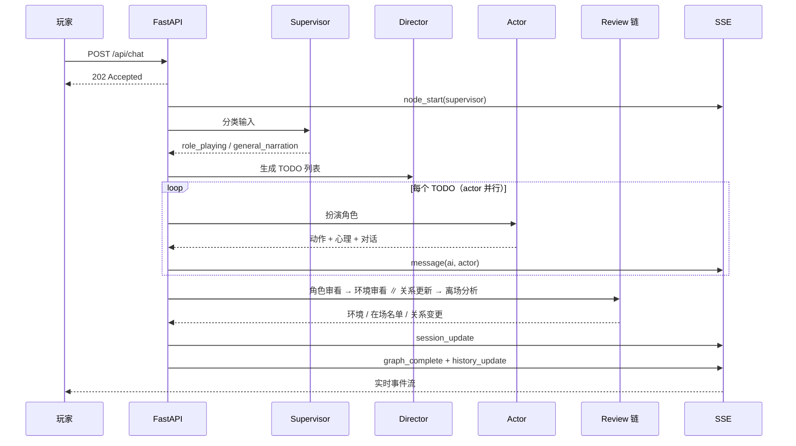

<div align="center">

# Role-Playing-Agent（RPA-Python）

基于 LangGraph 的 RPG 多智能体叙事引擎。

一次对话由 15 个专职节点组成的流水线处理：
输入分类 → 角色编排 → 角色扮演 → 旁白 → 审查链 → 记忆沉淀。

[](https://www.python.org/)
[](https://fastapi.tiangolo.com/)
[](https://langchain-ai.github.io/langgraph/)
[](https://www.trychroma.com/)
[](https://vuejs.org/)
[](https://opensource.org/licenses/MIT)

[快速开始](#快速开始) · [核心特性](#核心特性) · [架构](#架构) · [配置](#配置) · [API](#api-概览) · [常见问题](#常见问题)

</div>

---

## 项目概述

本项目基于 LangGraph 构建双层图（Supervisor 顶层调度 + Director 子图执行），将一次对话拆分为多个专职节点。各节点共享一份持久化状态：对话历史、角色记忆、关系图谱、情绪快照、环境状态。

与直接调用 LLM 单轮生成相比，本实现针对以下问题提供了对应处理：

| 问题 | 处理方式 |
|------|---------|
| 角色缺乏跨轮一致性 | 每轮结束生成第一人称记忆并写入向量库，下次扮演前按语义检索 |
| NPC 进出场无管理 | `introduce_character_node` 统一引入并推断初始关系；`review_character_node` 判定进出场 |
| 环境状态不更新 | `review_env_node` 逐轮审查位置 / 时间 / 氛围，变更推送前端 |
| 关系为静态人设 | `update_relationship_node` 依据本轮互动更新类型 / 强度 / 情感 / 权力动态 |
| 剧情无法干预 | `player_choice_node`（HITL）挂起图执行，等待玩家决策后继续 |
| 执行过程不可见 | 全链路 SSE 推送节点开始 / 结束、消息与状态变更 |

适用场景：互动小说、跑团辅助、剧情原型验证、多智能体编排参考实现。

---

## 核心特性

- **角色记忆** — 第一人称记忆摘要写入 ChromaDB，扮演前语义检索；每 N 轮（默认 10）自动总结，角色离场时生成离别记忆。
- **关系与情绪图谱** — 双向角色关系（类型 / 强度 / 情感 / 权力动态）与 append-only 情绪快照，随剧情更新。
- **环境状态管理** — 逐轮审查位置 / 时间 / 氛围，变更推送前端。
- **HITL 玩家选择** — `threading.Event` 阻塞图线程（最长 24h）等待玩家决策；页面刷新或服务重启后从持久化状态恢复。
- **实时可观测** — SSE 推送节点事件与消息；前端提供图拓扑可视化、节点执行日志流、逐节点提示词与上下文注入配置。
- **逐节点可配置** — 每个节点可独立设置模型、温度、最大 Token、思考模式与思考强度、最大上下文、系统提示词、上下文注入顺序及独立 API 端点。
- **本地优先** — SQLite + ChromaDB 落盘存储，嵌入模型本地推理（Qwen3-Embedding-0.6B）；可选接入 ComfyUI 生成场景插画，未配置时静默跳过。

---

## 快速开始

**环境要求**：Python ≥ 3.10（验证环境 3.13）· Node.js ≥ 20.19（仅前端）· 任意 OpenAI 兼容或 Anthropic LLM 端点（DeepSeek、月之暗面、OpenAI、Anthropic、本地 vLLM / Ollama 等）· 磁盘 ~2 GB（含嵌入模型权重）。Linux / macOS 一键启动另需 bash ≥ 3.2（系统自带）与 curl、lsof。

### 安装与启动

```bash
git clone git@github.com:PingLe12138/Role-Playing-Agent.git
cd Role-Playing-Agent

python -m venv .venv && .venv\Scripts\activate   # macOS/Linux: source .venv/bin/activate
pip install -r requirements.txt
```

一键启动（后端 + 前端同时拉起；端口被占时提示占用进程并等待处理，不会闪退；退出时自动停止服务）：

| 平台 | 命令 |
|------|------|
| Windows | `.\start.ps1` |
| Linux / macOS | `./start.sh` |

也可分开启动：

```bash
python -m uvicorn app:app --host 0.0.0.0 --port 8000   # 后端 → :8000
cd frontend && npm install && npm run dev              # 前端 → :5173
```

启动后：

| 地址 | 说明 |
|------|------|
| <http://localhost:5173> | PC 端管理界面 |
| <http://localhost:8000/docs> | Swagger 交互式 API 文档 |
| <http://localhost:8000> | 后端 REST API |

### 第一次使用

第一次打开前端进入初始化向导：填写模型连接（API Key / Base URL / 模型名，可测试连接）→ 选择玩法偏好（玩家选择开关、记忆总结间隔、可选 ComfyUI 插画）→ 完成核对。可跳过，之后在「配置」页随时修改或重跑向导。

也可直接修改配置文件：

```bash
cp config.template.json config.json    # 然后填 llm.api_key / base_url / default_model
```

> 嵌入模型默认从 `models/Qwen3-Embedding-0.6B` 本地加载，目录缺失时世界观检索不可用（向导完成页会提示）。

### 跑通第一个故事

1. **建世界观** — 「世界观」页新建集合（如「蒸汽朋克伦敦」），添加地点、组织、规则；常驻条目标记为 `isPermanent` 后永久进入上下文。
2. **建角色** — 「角色卡」页创建 NPC（人设、初始情绪、默认关系）；「用户角色」页创建玩家扮演的角色。
3. **开会话** — 「会话」页新建会话，绑定世界观与用户角色，设置初始场景与在场角色。
4. **开始对话** — 输入一句话，观察左侧节点事件流：调度 → 编排 → 角色扮演 → 旁白 → 审查 → 记忆。遇到抉择点弹出选项面板等待决策。

---

## 架构

### 系统架构



<details>
<summary><b>双层图结构与一轮对话的时序</b></summary>

```
Supervisor 图（顶层）
├── supervisor_node              LLM 分类：角色扮演 / 通用叙事指令
├── route_next_supervisor_todo   取下一个顶层 TODO
├── director_subgraph            子图（角色扮演处理管线）
└── general_narration_node       通用叙述指令执行

Director 子图
├── recall_node                  角色召回请求检测
├── introduce_character_node     新角色引入 + 关系 / 情绪种子
├── director_node                LLM 生成 TODO 列表（actor / narration / outline）
├── todo_batch_node              并行批量执行（actor 每角色并行，narration / outline 合并）
│   ├── actor_node               扮演指定角色（动作 + 心理 + 对话）
│   │   └── player_choice_node   HITL 玩家选择（阻塞 / 恢复三态机）
│   ├── narration_node           第三人称旁白
│   └── outline_node             增量剧情总结
├── review_character_node        新角色出现 / 角色离场（先行，产出最终在场名单）
├── review_env_node          ┐
├── update_relationship_node ┘   并行执行：环境变化 / 关系图谱更新
├── review_departure_node        扇入汇合：离场处理 + 离别记忆 + 子图收尾
├── image_gen_node               场景插画（可选，外部 ComfyUI，失败静默）
└── memory_node（条件）          角色记忆总结（每 N 轮）
```



</details>

---

## 配置

最小可用配置（`config.json`，已 gitignore）：

```json
{
    "llm": {
        "api_key": "sk-...",
        "base_url": "https://api.openai.com/v1",
        "default_model": "deepseek-v4-flash",
        "default_temperature": 0.9,
        "default_max_tokens": 8192,
        "is_enable_thinking": "enabled",
        "default_reasoning_effort": "high",
        "max_context_tokens": 0,
        "timeout_seconds": 600
    }
}
```

支持：逐节点独立接口 / 参数 / 提示词 / 上下文注入顺序、共享系统规则、功能开关、ComfyUI 插画、登录密码。完整配置项见下，也可在「配置」页直接编辑（下次对话生效，写入自动备份 `config.json.bak`）。

<details>
<summary><b>完整配置项</b></summary>

| 配置项 | 默认值 | 说明 |
|--------|--------|------|
| `llm.protocol` | `openai` | LLM 协议：`openai`（OpenAI 兼容）/ `anthropic`（Anthropic 官方 /v1/messages） |
| `llm.api_key` | — | LLM 提供商 API Key |
| `llm.base_url` | `""` | 服务地址；openai 协议下为 `/v1/chat/completions` 端点，anthropic 下留空使用官方默认地址 |
| `llm.default_model` | `deepseek-v4-flash` | 默认模型标识符 |
| `llm.default_temperature` | `0.9` | 生成温度（开启思考模式时忽略） |
| `llm.default_max_tokens` | `8192` | 最大输出 token |
| `llm.is_enable_thinking` | `enabled` | 思考模式开关（开启后忽略温度参数） |
| `llm.default_reasoning_effort` | `high` | 思考强度：`low` / `medium` / `high` / `max`（DeepSeek 端 medium 映射为 high）；仅思考模式开启时随请求发送 |
| `llm.max_context_tokens` | `0` | 发送给模型的提示词 token 上限（应用层按字符估算裁剪，保留最新一条消息）；`0` = 不裁剪 |
| `llm.timeout_seconds` | `600` | 单次请求读超时（秒）；非法 / 缺省回退 600 |
| `node_llm.<node>` | 继承全局 | 节点独享接口：`protocol` / `api_key` / `base_url` / `default_model` / `default_temperature` / `default_max_tokens` / `is_enable_thinking` / `timeout_seconds` / `default_reasoning_effort` / `max_context_tokens`，留空即继承全局。节点名见 `defaultconfig.json` 的 `node_params` 键 |
| `node_params.<node>` | 见 `defaultconfig.json` | 逐节点覆盖 temperature / max_tokens / is_enable_thinking / reasoning_effort / max_context_tokens |
| `node_prompts.<node>` | 代码内置 | 逐节点覆盖系统提示词（全量替换） |
| `node_contexts.<node>` | 见 `defaultconfig.json` | 逐节点配置注入哪些上下文块及顺序 |
| `system_rules` | 空 | 共享系统限制，自动追加到所有节点提示词末尾。**仓库不内置任何规则**，由使用者自行填写 |
| `features.player_choice_enabled` | `true` | 关闭后不再弹出玩家选择面板 |
| `features.memory_summarize_interval` | `10` | 每 N 轮执行一次角色记忆总结 |
| `embedding.model_path` | `models/Qwen3-Embedding-0.6B` | 本地嵌入模型目录 |
| `image_generation.*` | 见 `defaultconfig.json` | 场景插画（ComfyUI）配置，默认关闭 |
| `auth_password` | `""` | 前端登录密码，留空跳过认证 |
| `setup` | 缺失 = 未完成 | 初始化引导状态，由前端向导写入，不建议手改 |

参数优先级（同一次调用）：`node_params[node]` → `node_llm[node]` 客户端默认 → 全局 `llm`。逐次调用层的思考强度空串 / 最大上下文 `0` 视为「继承全局」。

</details>

---

## API 概览

共 81 个 REST 端点，完整交互式文档见 `http://localhost:8000/docs`（认证中间件保护所有 `/api/` 路由，登录接口除外；未设置 `auth_password` 时自动跳过认证）。

| 模块 | 数量 | 覆盖内容 |
|------|------|---------|
| `characters` | 19 | 角色卡、用户角色、角色关系、情绪状态 |
| `config` | 25 | LLM 配置、逐节点 LLM / 参数 / 提示词 / 上下文注入、功能开关、场景插画、配置导入导出、初始化引导 |
| `worldview` | 13 | 世界观集合与条目 |
| `sessions` | 11 | 会话管理、对话历史、会话导入导出 |
| `chat` | 6 | 对话触发、图执行状态、SSE 流、玩家选择提交 / 取消 |
| `misc` | 4 | 图拓扑、日志列表 / 实时流 / 读取、清空所有数据 |
| `auth_routes` | 3 | 登录状态、登录、修改密码 |

常用端点：

| 方法 | 路径 | 说明 |
|------|------|------|
| `POST` | `/api/chat` | 发送消息，返回 202，结果经 SSE 推送 |
| `GET` | `/api/chat/stream` | SSE 事件流 |
| `POST` | `/api/chat/choice` | 提交玩家选择（HITL） |
| `GET` | `/api/sessions/{id}/history` | 会话对话历史 |
| `GET/PUT` | `/api/config/llm` | LLM 连接配置 |
| `POST` | `/api/config/llm/test` | 测试 LLM 连通性 |
| `GET` | `/api/graph/topology` | 图拓扑结构（节点 + 边） |
| `GET` | `/api/logs/stream` | 日志实时流（SSE） |
| `GET` | `/api/setup/status` | 初始化引导状态 |

<details>
<summary><b>SSE 事件流</b></summary>

`POST /api/chat` 返回 `202 Accepted` 后立即返回，执行过程通过 SSE 推送。前端订阅 `GET /api/chat/stream`。

| 事件名 | 触发时机 | 载荷字段 |
|--------|---------|---------|
| `node_start` | 任意节点开始执行 | `node`, `sessionID`, `status` |
| `node_complete` | 任意节点执行完毕 | `node`, `sessionID`, `status` |
| `message` | 生成 AI / 旁白 / 选择结果消息 | `sessionID`, `contentType`, `content`, `role`, `sessionHistoryID` |
| `session_update` | 环境 / 在场角色 / 离场列表变化 | `envData`, `presentCharacter`, `sessionDepartedCharacter` |
| `history_update` | 图执行完成后的全量历史 | `sessionID`, `history` |
| `graph_complete` | 图执行结束（成功或失败） | `sessionID` |
| `graph_error` | 图执行异常 | `sessionID`, `error` |
| `player_choice` | 生成玩家选择面板 | `sessionID`, `context`, `choices`, `sessionHistoryID` |
| `ping` | 心跳（每 5 秒） | 空 |

消息的 `content` 多为 `{"contentType": "...", "content": ...}` 包装：`actor_response`、`narration`、`general_narration`、`player_choice_result`、`role_playing`、`scene_image`。

</details>

---

## 开发

```bash
pytest                      # 全量测试
pytest tests/ -q            # 静默模式
ruff check .                # lint（line-length 120）
ruff format .               # 格式化

cd frontend
npm run dev                 # 开发服务器 :5173
npm run build               # 生产构建
npm run format              # prettier
```

**改代码前先读 `AGENTS.md`**（本地提供，不入库）— 面向编码 agent 的实现级文档，包含节点职责、状态通道、归约器陷阱、端点清单与历史事故记录。

<details>
<summary><b>项目结构</b></summary>

```
Role-Playing-Agent/
├── app.py                      # FastAPI 入口（生命周期 + 认证中间件 + 挂载 routers）
├── routers/                    # REST 端点（7 个模块，共 81 个）
├── models.py                   # Pydantic 请求 / 响应模型
├── config_loader.py            # LLM / 节点参数 / 提示词 / 上下文 / 引导状态 配置加载
├── config.template.json        # 配置模板
├── defaultconfig.json          # 节点参数 / 提示词 / 上下文注入默认值
├── auth.py                     # 认证（单 token 模型，可选）
├── choice_waiter.py            # HITL 阻塞机制（threading.Event，24h 超时）
├── DatabaseManager.py          # SQLite 建表 + 幂等迁移
├── SQLiteClient.py             # SQLite 客户端（支持事务）
├── ChromaDBClient.py           # ChromaDB 客户端 + 嵌入模型
├── LLMStreamClient.py          # OpenAI 兼容 LLM 客户端（非流式）
├── AnthropicLLMClient.py       # Anthropic API 客户端（非流式）
├── SSEPublisher.py             # SSE 事件分发器
├── graph_logger.py             # 图执行日志
├── paths.py                    # 项目根锚定的路径常量（config/data/chroma/logs）
├── start.ps1                   # Windows 一键启动（后端 + 前端）
├── start.sh                    # Linux / macOS 一键启动（后端 + 前端）
│
├── RPA_langGraph/              # LangGraph 核心编排
│   ├── AgentState.py           # 状态定义 + 5 种归约器
│   ├── context_blocks.py       # 上下文块注册表（可配置注入）
│   ├── supervisor_graph.py     # 顶层 Supervisor 图
│   ├── director_subgraph.py    # Director 子图
│   └── nodes/                  # 15 个图节点实现
│
├── services/                   # 数据访问服务层
│   ├── base.py                 # BaseService CRUD 基类
│   ├── character.py / user_character.py / relationship.py / emotion.py
│   ├── worldview.py / session.py
│   ├── formatters.py           # 格式化 + LLM JSON 解析
│   ├── id_utils.py             # ID 生成（拼音 + 时间戳 + UUID）
│   └── comfyui_client.py       # ComfyUI REST 客户端（urllib 零依赖）
│
├── frontend/                   # PC 端前端（Vue 3 + Element Plus + Pinia + Vite）
├── tests/                      # pytest 测试
├── data/                       # SQLite 文件（运行时）
├── chroma_data/                # ChromaDB 持久化（运行时）
├── logs/                       # 图执行日志（运行时）
├── static/scene_images/        # 场景插画产物（/static 提供）
├── models/                     # 嵌入模型权重（gitignored）
└── AGENTS.md                   # 实现级架构文档（本地提供，不入库）
```

</details>

---

## 参与贡献

欢迎提交 Issue（bug、功能建议）与 PR。开发约定：

1. 先读本地的 `AGENTS.md`（不入库）了解节点职责与状态通道约定
2. 通过 `pytest` 与 `ruff check .` 后提交
3. 新增叙事能力采用「新增节点 + LLM 产出对应 TODO」的扩展方式，不改动图连线

---

## 常见问题

**支持哪些模型？**
任意 OpenAI 兼容端点。全局配置一次即可，也可为单个节点配置独立接口（如编排用强模型、旁白用低成本模型）。

**必须联网吗？**
LLM 调用需要联网（或指向本地 vLLM / Ollama）。嵌入模型为本地推理，首次运行加载 `models/Qwen3-Embedding-0.6B`。

**输出是流式的吗？**
当前 LLM 调用为非流式，SSE 推送节点粒度事件与整段消息；节点执行过程、状态变更、消息到达为实时推送。

**ComfyUI 是必需的吗？**
不是。场景插画默认关闭，未开启或生成失败时静默跳过，不影响对话；开启后需在配置页填写 ComfyUI 服务地址。

**忘记登录密码怎么办？**
`config.json` 中 `auth_password` 为明文存储，直接修改或删除该字段即可（删除后跳过认证）。

**数据存在哪里，怎么迁移？**
全部本地存储：SQLite（`data/rpa_data.db`）+ ChromaDB（`chroma_data/`）。会话 / 角色卡 / 节点配置支持导出为 JSON，可在另一台机器导入。

**为什么我改了提示词没生效？**
提示词、参数、上下文注入在下次对话时读取，正在进行的会话不受影响。配置写入后自动备份到 `config.json.bak`。

---

## License

本项目采用 **MIT** 许可证。
